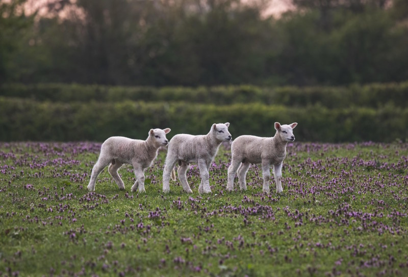
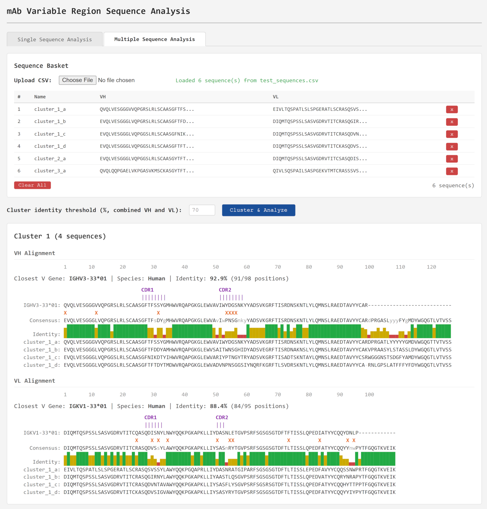

# LAMBS - Local Analysis of mAb Sequences



## About

Completely free, private, and self-contained analysis of monoclonal antibody (mAb) sequences. Analyze gene segments, germline mutations, CDRs, developability liabilities, and more.

The best part? It's a single html file that runs offline in a web browser, which means no installation, no programming, and your sequences stay private!

Code is open source, permissively licensed under Apache 2.0, and available at [https://github.com/dcroote/lambs](https://github.com/dcroote/lambs).

## Usage

1. Download `index.html` from the [latest release](https://github.com/dcroote/lambs/releases/latest)
2. Open `index.html` in your web browser
3. Enter your VH and VL amino acid sequences and click "Analyze"
4. View the results
5. Make better antibodies for humankind!

## Screenshot



## Developer notes

### Testing

```
node test.js
```

### Populating the V_GENE_DB object in index.html

```
python3 populate_germlines.py
```

### Background: IgBLAST used to annotate CDRs

This was run in a separate directory containing IgBLAST v1.22.0 and IMGT sequences. For mouse, `human` was replaced with `mouse` in all arguments. Assumes the database files (outputs of `makeblastdb`) were in the `db` directory. Assumes the auxiliary data is in the `optional_file` directory (standard, comes with IgBLAST).

```
./bin/igblastn \
    -germline_db_V db/human_V.fasta \
    -germline_db_D db/human_D.fasta \
    -germline_db_J db/human_J.fasta \
    -num_alignments 1 \
    -ig_seqtype Ig \
    -organism human \
    -outfmt 19 \
    -auxiliary_data optional_file/human_gl.aux \
    -domain_system imgt \
    -query db/human_V.fasta \
    -out igblast_human_V.tsv
```

### Background: Initial prompt and plan

For those curious, see `.cursor/initial.prompt.md` and `.cursor/initial.plan.md` for the original prompt and plan, respectively.

## Other

Photo credit: [theotherkev](https://pixabay.com/photos/sheep-lamb-animals-livestock-farm-7943526/).
