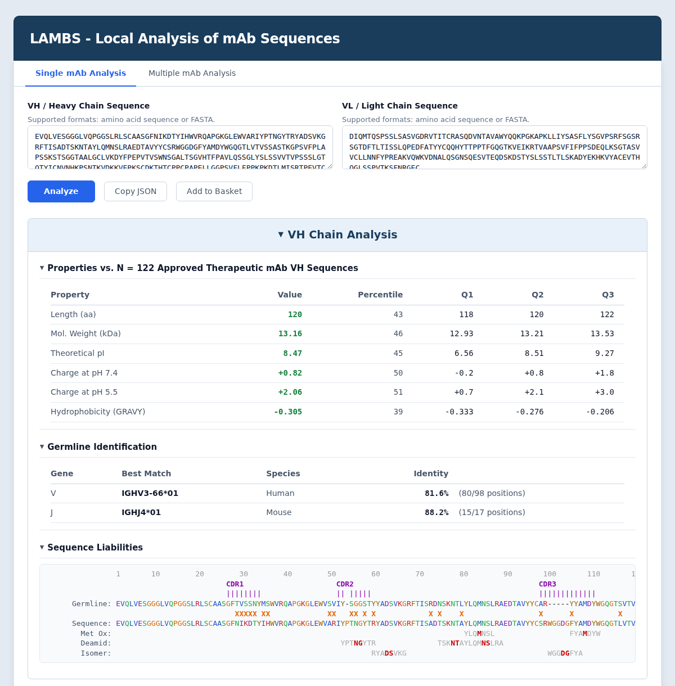
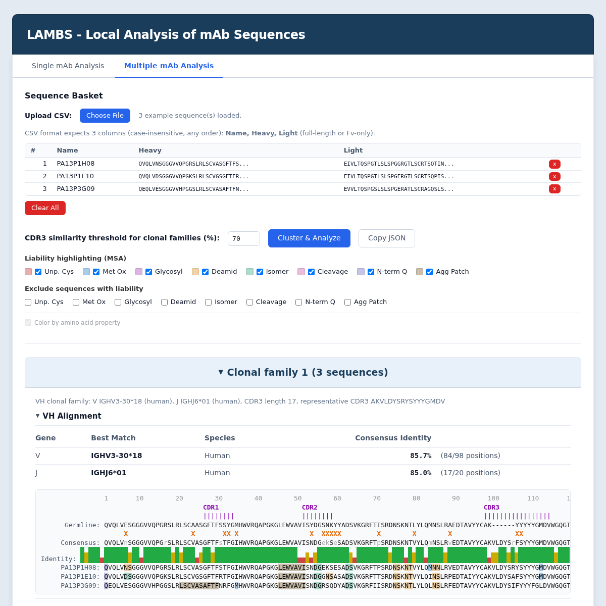

# LAMBS - Local Analysis of mAb Sequences

## About 🐑

Completely free, private, and self-contained analysis of monoclonal antibody (mAb) sequences.

The best part? It's a single html file that runs offline in a web browser, which means no installation, no programming, and your sequences stay private!

Code is open source, permissively licensed under Apache 2.0, and available at [https://github.com/dcroote/lambs](https://github.com/dcroote/lambs).

## Features

- **Developability liability identification**: deamidation, isomerization, glycosylation, unpaired cysteines, and more.
- **Germline gene identification and alignment**: human and mouse with annotation of somatic hypermutation and CDRs.
- **VH and VL chain properties**: length, molecular weight, theoretical pI, net charge at pH 7.4 and 5.5, and GRAVY with percentiles and quartiles versus approved therapeutic mAb sequences.
- **Constant region identification**: human and mouse with alignments showing similarity to wildtype constant regions.
- **Batch analysis**: sequence clustering with multiple sequence alignment, AA conservation plots, and consensus sequences per cluster. Accepts CSV upload.
- **Verified analysis logic**: core algorithms are covered by extensive unit tests; run locally with `node test.js`.
- **Privacy**: everything runs locally in the browser. No tracking and no data is sent anywhere.

## Usage

1. Download `index.html` from the [latest release](https://github.com/dcroote/lambs/releases/latest)
2. Open `index.html` in your web browser
3. Enter your VH and VL amino acid sequences and click "Analyze"
4. View the results
5. Make better antibodies for humankind!

## Screenshot - Single mAb Analysis



## Screenshot - Multiple mAb Analysis



## Developer notes

### Testing

```
node test.js
```

### Populating the V_GENE_DB object in index.html

```
python3 scripts/populate_germlines.py
```

### Populating the APPROVED_MAB_STATS object in index.html

```
python3 scripts/compute_reference_stats.py
```

### Releases and versioning

The project uses [commit-and-tag-version](https://github.com/absolute-version/commit-and-tag-version). The semver source of truth is **`package.json`**; each release bumps that version, updates the changelog, updates the footer in `index.html`, and creates a git tag.

After installing dev dependencies:

```
pnpm install
# for bug fixes and minor features
pnpm release
# for feature releases pre-v1.0
pnpm release --release-as minor
```

Adding release notes to the GitHub release (also remember to add `index.html` to the release assets):

```
awk '/^## \[/{if(found) exit; found=1; next} found' CHANGELOG.md > release_notes.md
less release_notes.md
```

**Note:** The footer always shows the **last released** version. If `main` has commits after that tag, the app may include newer code than that number indicates. For a published build, use the tagged release or run a new release when appropriate.

### Background: IgBLAST used to annotate CDRs

This was run in a separate directory containing IgBLAST v1.22.0 and IMGT sequences. For mouse, `human` was replaced with `mouse` in all arguments. Assumes the database files (outputs of `makeblastdb`) were in the `db` directory. Assumes the auxiliary data is in the `optional_file` directory (standard, comes with IgBLAST).

```
./bin/igblastn \
    -germline_db_V db/human_V.fasta \
    -germline_db_D db/human_D.fasta \
    -germline_db_J db/human_J.fasta \
    -num_alignments 1 \
    -ig_seqtype Ig \
    -organism human \
    -outfmt 19 \
    -auxiliary_data optional_file/human_gl.aux \
    -domain_system imgt \
    -query db/human_V.fasta \
    -out igblast_human_V.tsv
```
